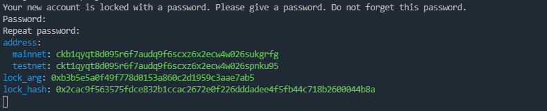
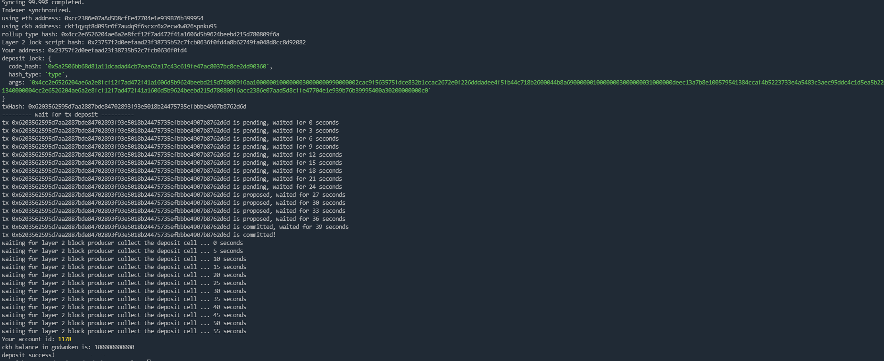

# Task 1: Create A Godwoken Account On The EVM Layer 2 Testnet

## 1.A screenshot of the accounts you created (account list) in ckb-cli.

## 2.A link to the Layer 1 address you funded on the Testnet Explorer.

https://explorer.nervos.org/aggron/address/ckt1qyqt8d095r6f7audq9f6scxz6x2ecw4w026spnku95

## 3.A screenshot of the console output immediately after you have successfully submitted a deposit to Layer 2.

