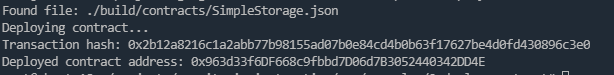

# Task 2: Deploy A Simple Ethereum Smart Contract On Polyjuice

## 1.A screenshot of the console output immediately after you have successfully deployed a smart contract.

## 2.The transaction hash from the contract deployment (in text format).

0x2b12a8216c1a2abb77b98155ad07b0e84cd4b0b63f17627be4d0fd430896c3e0

## 3.The deployed contract address from the contract deployment (in text format).

0x963d33f6DF668c9fbbd7D06d7B3052440342DD4E
