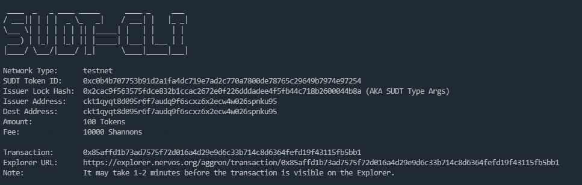
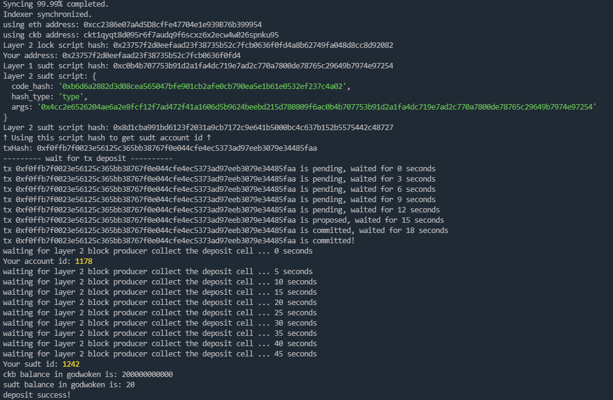

# Gitcoin: 4) Issue An SUDT Token On Layer 1 And Deposit It To Layer 2

## 1.A link to the Layer 1 address you funded on the Testnet Explorer.

https://explorer.nervos.org/aggron/address/ckt1qyqt8d095r6f7audq9f6scxz6x2ecw4w026spnku95

## 2.A screenshot of the console output immediately after using sudt-cli to create your SUDT tokens on Layer 1.

## 3.A link to the transaction ID created by sudt-cli on the Testnet Explorer.

https://explorer.nervos.org/aggron/transaction/0x85affd1b73ad7575f72d016a4d29e9d6c33b714c8d6364fefd19f43115fb5bb1

## 4.A screenshot of the console output immediately after you have successfully submitted a deposit to Layer 2 using the account-cli tool.

## 5.The SUDT ID from the console output after executing the deposit script (in text format).

SUDT ID: 1242
