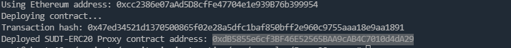
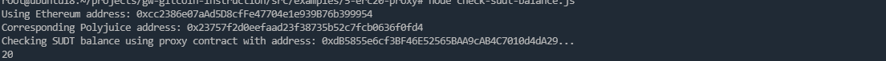

# Gitcoin: 5) Deploy The ERC20 Proxy Contract For The Deposited SUDT

## 1.A screenshot of the console output immediately after deploying smart contract.

## 2.The address of the ERC20 Proxy Contract you deployed (in text format).

0xdB5855e6cf3BF46E52565BAA9cAB4C7010d4dA29

## 3.A screenshot of the console output immediately after checking your SUDT balance.

## 4.The Ethereum address that was checked (in text format).

0xcc2386e07aAd5D8cfFe47704e1e939B76b399954
