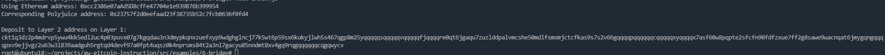

# Gitcoin: 6) Use Force Bridge To Deposit Tokens From Ethereum To Polyjuice

## 1.A screenshot of the console output immediately after you have successfully generated your Deposit Receiver Address.

## 2.Your Deposit Receiver Address (in text format).

ckt1q3dz2p4mdrvp5ywu4kk5edl2uc4p03puvx07g7kgqdau3n3dmypkqnxzuefxyp9wdghglncj77k5wt6p59sx6kukyjlwh5s467qgp8m25yqqqqqsqqqqqvqqqqqfjqqqqre0qt6jgaqu7zuzlddpalvmcshe50mdlfsmxmjctcfkas9s7s2v66gqqqqpqqqqqqcqqqqqxyqqqqx7asf60w8pqpte2sfcfn90fdfzxue7ff2g8sawe9wacnqat6jmygqngqqqqpxv9ejjvgz2u63w3l839aadguh5rgtqd4devf97a0fpt4uqsz0k4nprsms84t2a3nl7gacyu85nndmt8xv4gq9rqgqqqqqqcqgqwycv

## 3.The Ethereum address used to generate the Deposit Receiver Address (in text format).

0xcc2386e07aAd5D8cfFe47704e1e939B76b399954

## 4.A link to the Etherscan explorer for the successful Force Bridge transaction. This can be found on Force Bridge under History→Succeed.

https://rinkeby.etherscan.io/tx/0x8f495c663efe71c011794f76d9cef1cc1dc5753941783ff24bc80e79d867d389

## 5.A link to the Nervos explorer for the successful Force bridge transaction. This can be found on Force Bridge under History→Succeed.

https://explorer.nervos.org/aggron/transaction/0xaeb5fd3d6a0e06cea7868ad848d7801e86e52f15cdd61d6d444a17c43c45a7f5
