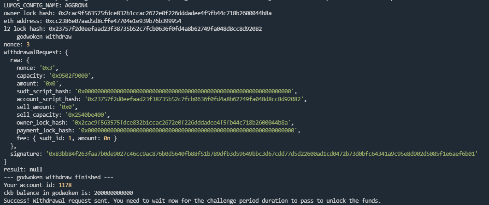

# Gitcoin: 9) Initiate Withdrawal Process From The Layer 2 Back To Layer 1

## 1.A screenshot of the console output immediately after running the withdraw command.

## 2.The Ethereum address that you've used for your Layer 2 account (in text format).

0xcc2386e07aAd5D8cfFe47704e1e939B76b399954

## 3.The Nervos Layer 1 address that you passed to withdraw command (in text format).

ckt1qyqt8d095r6f7audq9f6scxz6x2ecw4w026spnku95
